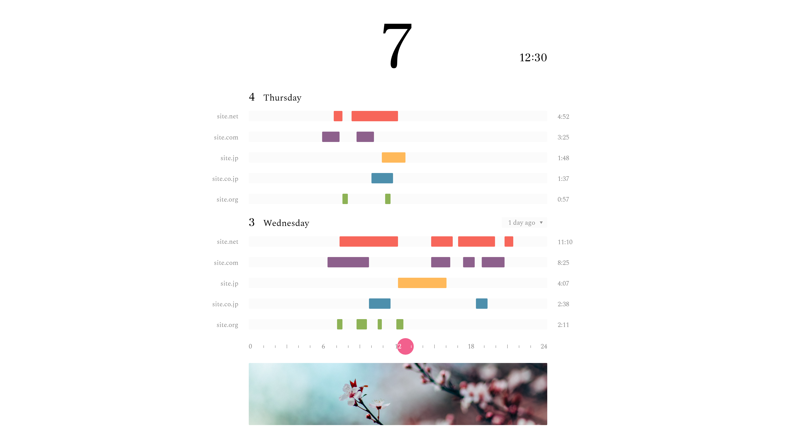
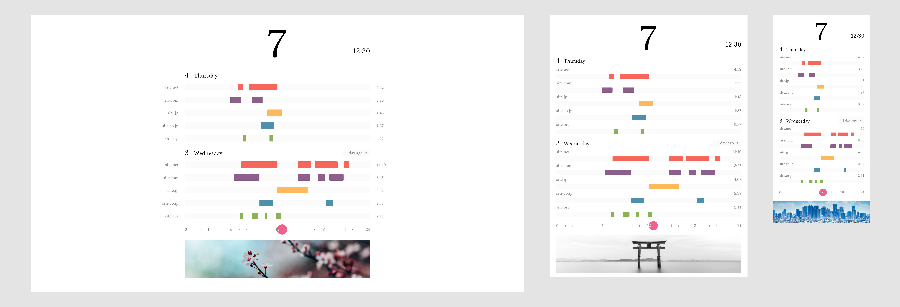
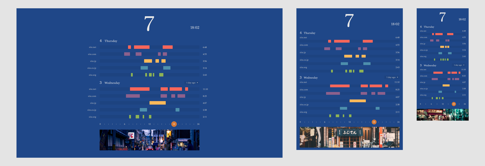
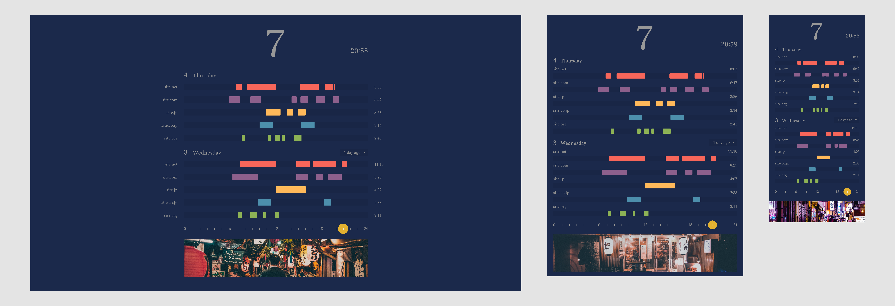

# Hourglass

With recent discussions surrounding misinformation and personal privacy, there has been escalating concern over the effects of the internet and the attention economy. Most of the digital economy is supported by the advertising model, which generates revenue by monetizing people's time and attention. The contest for people's finite attention has incentivized platforms, such as Instagram, Twitter, and YouTube, to optimize their designs and content recommendation algorithms to maximize addictiveness and, therefore, advertising revenue.

This manipulative behavior led to the creation of movements and organizations such as [Time Well Spent](https://humanetech.com/), which advocate for people to take back control of their attention to improve digital well-being. In response, Apple has introduced [Screen Time](https://www.apple.com/newsroom/2018/06/ios-12-introduces-new-features-to-reduce-interruptions-and-manage-screen-time/) with iOS 12 and Google released [Digital Wellbeing](https://wellbeing.google/) for Android. Both help users visualize app usage and self-impose limits on how much time they spend on their mobile devices.

Similar tools have been available on desktop and laptop operating systems for some time. These aids, however, are often tucked away behind menus, reducing their accessibility. They also focus primarily on total time spent, making it difficult to see apps we are constantly distracted by but spend little time on. In addition, fixed time limits are very rigid compared to our more unstructured behavior. To accommodate for this, time limit mechanisms often include easy bypasses which obviate their purpose.

## Making Time More Tangible

We need to become cognizant of our own behavior before we become concerned with it. When people perceive a divide between how people think they behave and how they actually behave, they experience [cognitive dissonance](https://www.youtube.com/watch?v=h6HLDV0T5Q8&feature=youtu.be&t=505). To resolve this contradiction, humans adjust their expectations and actions to make them consistent with one another. Increasing the visibility of our time-tracking information creates a consistent feedback loop that keeps us attentive of our conduct.

Hourglass is a concept designed to replace the new tab page in browsers. Every time a user opens a blank new tab, they will be presented with a visualization of their browsing behavior. This increases information accessibility and continually reminds users of how they spend their time, removing the need for heavy-handed interventions, such as time limits, which users interact with only once or a few times per day.

Browsing information is presented in a Gantt chart: The first three sites are the places user spent the most time at, while the remaining two sites are those visited frequently regardless of total time spent. Users can see sites they may visit quickly and frequently, such as social media websites.

A chart for a day within the past week is displayed as a reference to change behavior around. Keeping data from only the past seven days allows for comparisons with only recent information while accommodating for off days, like times when we binge read or watch an entire series. Limiting choices to the past seven days also addresses the [Paradox of Choice](https://www.ted.com/talks/barry_schwartz_on_the_paradox_of_choice), reducing cognitive load when deciding on what day to show.

The color palette and banner photo change depending on the time of day and the user's location, with specific themes for day, twilight, and night.

### Day

### Twilight

### Night

## Considerations

Humans can generally only focus on a single task at a time. To deal with multiple concurrent activities, we perform constant context switching. Time tracking tools only record the current site a user is on, which can result in short time intervals that create bars less than a pixel wide when quickly switching between sites. Hourglass imposes a minimum bar length of four pixels which may result in overlapping bars. In light of how humans multitask, these overlapping bars represent a continuous browsing period on a given site.

The distribution of time spent between sites follows a [power law](https://en.wikipedia.org/wiki/Power_law) for most people, where the total time spent in one place is inversely proportional to its rank among all locations. As a result, Hourglass displays only the handful of websites whose time allotments cause concern while removing extraneous browsing information.

## Installation
This project is a Chrome Web Extension, here are the instructions you should follow to run it:
1. In project folder, run: `npm install` and then `npm run build`
2. In Chrome, go to: `chrome://extensions/`, and enable Developer Mode.
3. Click `Loaded unpacked button` and import the build folder inside the project folder.
4. Once the app is added in Chrome, you can open a new tab and see the project home page and explore it.

Alternative, use `web-ext`, a web extension testing utility with hot reloading provided by Mozilla to test in Firefox. To use, install it using `npm install web-ext -g`, then navigate into the build folder and do `web-ext run`.

Chrome has some buggy behavior with its window onFocusChanged event, where it erroneously reports that all Chrome windows become unfocused when browsing normally.
Chrome's window.onFocusChanged event also does not fire when all Chrome windows go out of focus.

Mozilla Firefox does not exhibit any of these issue, thus it is recommended to use Firefox for long-term testing.

## Credits

Implementation: Mingchao Zhang, Kevin Su, Junyoung Kim, Cheng Hu

Art Direction, UI/UX Design, Documentation: Kevin Su

## References

KOSHO TSUBOI DESIGN — Magic Calendar

[Magic Calendar Concept Video](https://www.youtube.com/watch?v=2KDkFgOHZ5I)

[Android Experiments OBJECT](https://www.android.com/object/vote/magic-calendar/)
